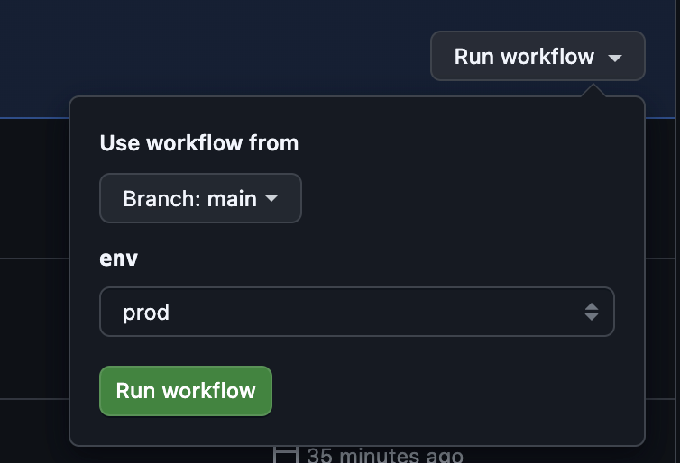

# Mandeep_Demo

## Tech Stack
### Language: Typescript
### Testing libraries: Playwright

## Running Playwright Tests -- Local 

To run the Playwright tests locally, follow these steps:

1. **Install Dependencies**:
    Make sure you have all the necessary dependencies installed. You can do this by running:
    ```sh
    npm install && npx playwright install chromium 
    ```

2. **Run Tests**:
    Execute the tests using the following command:
    ```sh
    BASE_URL=<domain>  EMAIL=<email>  PASSWORD=<password>  npm run test
    ```

3. **View Test Report**:
    After the tests have run, you can view the test report by opening the generated HTML report:
    ```sh
    npx playwright show-report
    ```

## Running Playwright Tests -- Github Actions

To run the Playwright tests locally, follow these steps:
1. **Create environment variables**:
    Created BASE_URL as an environment variable
    Created EMAIL & PASSWORD as an environment secret

    ***Github environment - prod && dev url***
    https://github.com/msaggu/Mandeep_Demo/settings/environments
    NOTE: Currently, environemnt variables and secret are same for both dev and prod environment. Please change the values as needed. 

2. **Run Tests**:
    Navigate to the url: 
    ```sh
    https://github.com/msaggu/Mandeep_Demo/actions/workflows/e2e.yml
    ``` 

    Go to Playwright Tests under All workflows.
    Click on Run workflow, select the env as needed and click on Run workflow button
    


